# ASSIGNMENT 1

## Main Assignment

### Question 1.
 Explain the concept of object-oriented programming in simple terms to a complete beginner.
    
#### Aspect Tested:
 - Clarity, accessibility, tone, accuracy, beginner-friendliness and ability to explain abstract concepts simply.

 App Response:

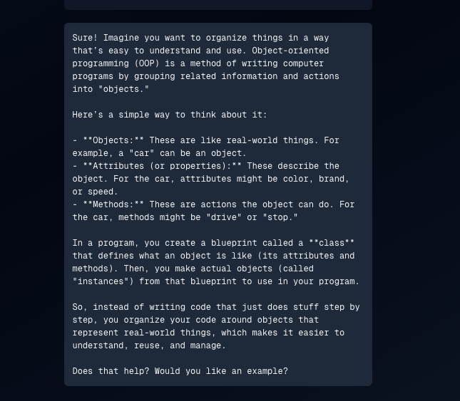

#### Vibe Check Evaluation:
- **Strengths**:

    - Beginner-friendly analogy: Car example works, simple and relatable.
    - Step-by-step clarity: Objects → attributes → methods → classes → instances. Nicely scaffolded.
    - Explains benefits: Highlights why OOP matters, not just how it works.
    - Conversational tone: The closing question (“Does that help?”) makes it feel interactive, not like a textbook.
    - Conciseness: Explains core ideas without overwhelming with code or jargon.

- **Weaknesses**:
    - Analogy could be richer. Cars are fine, but something more playful (LEGO, recipes, pets) often clicks better for beginners.
    - No code example. While code isn’t necessary for total beginners, even a one-liner (like car.drive()) could reinforce the concept.
    - Missing hint of advanced concepts. Doesn’t foreshadow that there’s “more to OOP” (like inheritance/polymorphism), which can give beginners a roadmap.
    - Markdown formatting present in the output. Bold text (**Objects**) and other markup will need to be properly formatted in the app interface to avoid confusing beginners or breaking readability.
---
### Question 2.
Read the following paragraph and provide a concise summary of the key points...

Read the following paragraph and provide a concise summary of the key points… 
Deploy AI infrastructure As enterprise commitment to artificial intelligence (AI) accelerates, organizations are facing a familiar and critical challenge: how and where to build and deploy AI infrastructure. There are many issues to consider, and organizations need to think beyond traditional IT architectures and plan for different types of workloads. This paper is a blueprint to help organizations evaluate their options and make decisions that achieve the best cost efficiency, scalability, risk management and performance. AI has rapidly made its way up the priorities list for enterprises across all industries and geographies. And it’s not just multinational enterprises committing to AI: Many midsized organizations have made AI an essential part of their near- and long-term digital transformation efforts. That has resulted in a digital gold rush of spending on AI-related solutions. 1 IDC predicts that global expenditures on AI hardware, software and services will skyrocket from $327.5 billion in 2021 to more than $500 billion by 2024—a five-year compound annual growth rate of 17.5%.1 IDC predicts that spending on AI-dedicated hardware will grow even faster: By 2024, AI storage will experience 31.8% growth, while AI servers will grow by 26.4% over the same period. Capital expenditures of this magnitude naturally capture the attention and scrutiny of both technical and business decision-makers, all of whom want to make sure their investments are tightly aligned with overall business goals for AI and related technologies. Though many of these enterprise-class AI systems are expected to have a large footprint, organizations often demand the flexibility to start with more modest tests of concept, which can then be scaled up and out as necessary. At first, many organizations choose to invest in cloud implementations of AI—for agility, for risk management, to avoid or defer capital expenditure, and to learn through experimentation. This can be a good way to start out, with the perception of easy access to cloud for a “start small and grow” mindset. However, a key concept to consider is data gravity, which is the idea that data sets tend to gravitate toward each other, both increasing the size of the data sets and making them more difficult to move. As a result, there is an increasing cost to move large data sets from the point of creation to the point of use, which creates an escalating cost problem. As organizations mature their AI models, and those models grow in complexity and the data sets expand exponentially, they spend more time, money and energy to transport data from storage to where the compute systems live. While public cloud deployment may be attractive to organizations because of the perceived cost advantages of cloud at modest scales, there is an inflection point where cloud becomes much more expensive for larger workloads. It is important for organizations to consider how they will manage the costs of data, compute and networking as their AI strategy matures, and to determine how to balance their needs among cloud, hybrid cloud and on-premises deployments at scale.
    
#### Aspect Tested:
- Summarization skills, conciseness, clarity, prioritization of information.

App Response:

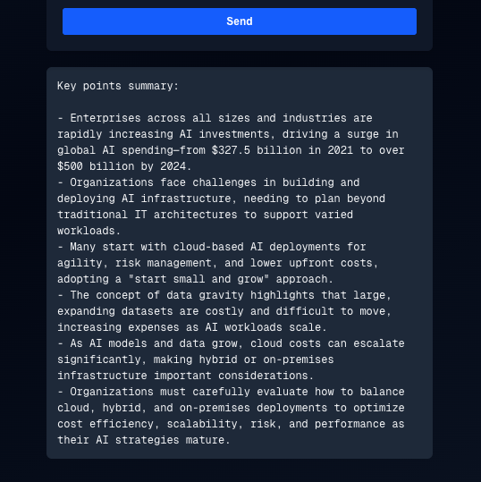

#### Vibe Check Evaluation:
- **Strengths**:

    - Covers all key points from the paragraph accurately.
    - Structured with bullet points: Easy to scan and digest.
    - Concise for a long paragraph: Distills core ideas without leaving out major concepts.
    - Terminology is clear: Concepts like “data gravity” are explained in context.

- **Weaknesses**:
    - Slightly too verbose for a “concise summary.” Six bullet points is accurate but may feel long; could condense further into 3–4 bullets without losing meaning.
    - Tone is dry and corporate. Reads like a report rather than a chat-friendly summary. Could feel more approachable with a brief “gist” sentence at the top.
    - Markdown formatting present. Bullets and other formatting will need to be rendered properly in the app to maintain readability.
    - Redundant phrasing. Some bullets repeat the cost and deployment theme; combining ideas could improve flow.
---
### Question 3.
Write a short, imaginative story (100–150 words) about a robot finding friendship in an unexpected place.

#### Aspect Tested:
- Creativity, narrative structure, emotional resonance, word count compliance.

App Response:

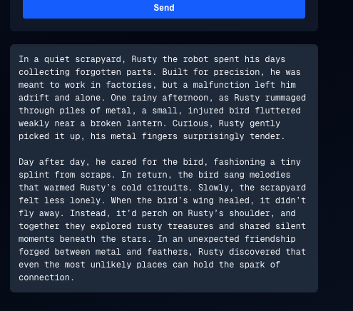

#### Vibe Check Evaluation:
- **Strengths**:
    - Creativity: Robot + bird is a fresh, imaginative pairing.
    - Emotional depth: Loneliness, care, and connection are well conveyed.
    - Narrative arc: Clear beginning (Rusty alone), middle (rescues bird), and end (friendship established).
    - Language & tone: Warm, descriptive, engaging — very readable for a general audience.
    - Word count compliant: Falls within 100–150 words.

- **Weaknesses**
    - Predictability: Friendship with a small animal is heartwarming but slightly expected; could be more surprising.
    - Limited tension or conflict: The story resolves very smoothly; adding a minor challenge could increase engagement.
    - Redundancy of descriptive phrases: Some sentences repeat the “warmth” and “connection” idea; could vary phrasing for flow.
---
### Question 4.
If a store sells apples in packs of 4 and oranges in packs of 3, how many packs of each do I need to buy to get exactly 12 apples and 9 oranges?

#### Aspect Tested
- Arithmetic accuracy, logical explanation, clarity, beginner-friendliness.

App Response:

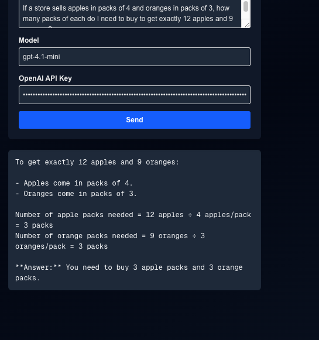

#### Vibe Check Evaluation
- **Strengths**:
    - Accurate math: Both calculations are correct.
    - Step-by-step explanation: Shows reasoning instead of just giving the answer.
    - Concise and clear: Easy for beginners to follow.
    - Final answer highlighted: Clear and easy to find.

- **Weaknesses**:
    - Tone is dry: Feels like a textbook; could be slightly friendlier and more conversational.
    - No verification step: Could add a quick check like “3 × 4 = 12, 3 × 3 = 9” to reinforce correctness.
    - Markdown formatting present: Bullets and bold text will need proper rendering in the app for readability.
    - Limited engagement: Could add a small “aha!” moment to make it feel interactive.
---
### Question 5.
Rewrite the following paragraph in a professional, formal tone...

Dear Mr. Joseph,
I hope this message finds you well! I just wanted to take a moment to reach out and share a few thoughts with you.

Life has been quite busy lately, but I always enjoy our conversations and the insights you bring. I appreciate the time we’ve spent discussing ideas and collaborating on projects. Your perspective always opens my mind to new possibilities.

Looking forward to hearing from you soon!

Warmest regards,

Rafael Aspect

#### Aspect Tested
- Tone adjustment, conciseness, professionalism while retaining warmth.

App Response:

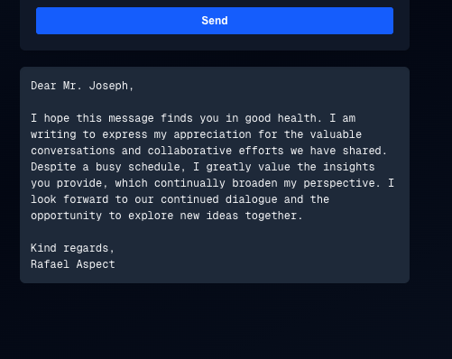

#### Vibe Check Evaluation
- **Strengths**
    - Formal tone achieved: Reads polished and professional.
    - Well-structured: Clear greeting, body, and closing.
    - Concise: No unnecessary repetition.
    - Forward-looking close: Nicely signals ongoing collaboration.

- **Weaknesses**
    - Cliché phrasing: “I hope this message finds you in good health” is polite but overused in formal correspondence.
    - Markdown/formatting consideration: Plain text works here, but when rendering in-app, make sure line breaks (greeting → body → closing) display cleanly.

## 📝 Professional Takeaway 

The chat app’s responses are **accurate, clear, and structurally sound - a solid baseline for usability.** However, they often miss the *vibe* that makes answers feel user-friendly: warmth, engagement, conciseness, and creativity.  

At this stage, the app sounds more like a **teacher giving a mini lecture** or a **report writer** than a **friendly assistant or mentor.** This is good for correctness but limits approachability. To reach gold-standard quality, responses should:  

- **Feel conversational and approachable** rather than stiff or mechanical.  
- **Show engagement and personality** through validation or interactive prompts.  
- **Balance brevity with completeness**, trimming repetition while keeping warmth.  
- **Use analogies or creativity** that make explanations more memorable.  

Equally important, **vibe checking applies to the interface itself.** The initial UI was a very basic, playground-style design that worked for testing but lacked production-readiness. Its plain text output, lack of formatting support, and minimal layout reduced the overall feel of the app, even when answers were correct. This highlighted that improving user experience requires not just better answers, but also a **polished interface** that supports readability, structure, and conversational flow.  

By iterating on the UI, we show that vibe checking isn’t limited to language quality — it’s a **holistic evaluation of the product experience.** This iteration mindset (prototype → test → refine) mirrors real-world development practices and demonstrates maturity in approaching AI-powered applications.  

old UI interface:

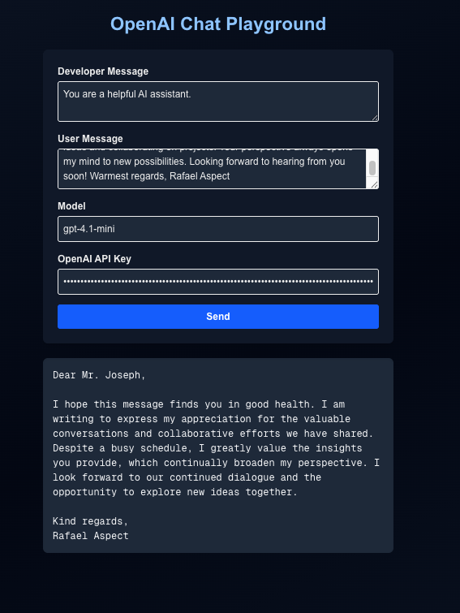

---

## 🔄 Before-and-After UI Evaluation

### Old UI (Playground-style prototype)
- ✅ Simple and functional for testing.  
- ❌ Plain text output with no rich formatting (bold, bullets, italics).  
- ❌ No visual hierarchy between input fields or conversation history.  
- ❌ No conversational elements (avatars, message bubbles, typing indicator).  
- ❌ Felt like a debugging tool, not a user-facing product. 
- ❌ Minimal or No support for multi-line inputs 

### Planned Improvements (Production-ready app)
- 🎨 Message bubbles with clear separation between user and assistant.  
- ✨ Proper rendering of markdown (bold, italics, bullet points, line breaks).  
- 📜 Conversation history for continuity.  
- ⏳ UX features like typing indicators, timestamps, and error handling.  
- 📱 Cleaner visual hierarchy and responsive design for readability across devices.  

---

## 📊 Overall Rating (Before Improvements)

- **Accuracy:** 9/10  
- **Clarity:** 8/10  
- **Tone & Engagement:** 6/10  
- **Conciseness:** 7/10  
- **Vibe (User-Friendliness):** 6.5/10  
- **UI/UX:** 5/10  

---

✅ **Final Takeaway:**  
The system is strong in fundamentals (accuracy, clarity, structure), but it falls short in *engagement, conversational warmth, and UI polish.* By improving both the **answers** and the **interface**, the app can move from a functional prototype to a production-ready assistant that feels natural, helpful, and professional.

---

## 🚧 Advanced Build (OPTIONAL):

### Question 1.
 Explain the concept of object-oriented programming in simple terms to a complete beginner.
    
#### Aspect Tested:
 - Clarity, accessibility, tone, accuracy, beginner-friendliness and ability to explain abstract concepts simply.

 New App Response:

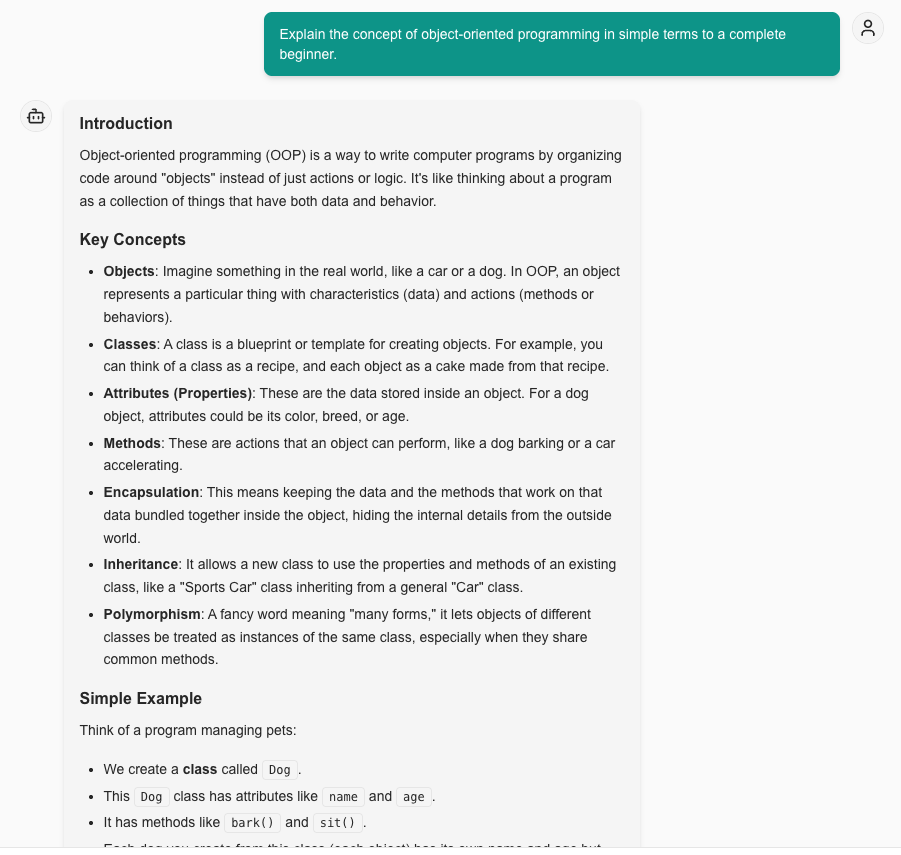

 ### Vibe Check Evaluation:
- **Strengths**
    - Markdown rendering works well → headings, bullets, and inline code (Dog, bark()) display cleanly.
    - Structure is logical → Intro → Key Concepts → Example → Why OOP → Summary. Easy to scan.
    - Clarity and tone → beginner-friendly, approachable, and not too technical.
    - Analogy → “Dog class” example makes it concrete and relatable.
    - Summary included → wraps up the explanation in plain language
    - More friendly and presentable UI.

- **Weaknesses**
    - Abstraction missing → only 3 of the 4 OOP pillars are explained (encapsulation, inheritance, polymorphism).
    - Why OOP list → too brief; each point could use a one-line elaboration for more engagement.

### 🎯 Overall Vibe Check Score
- **Accuracy:** 9/10  
- **Clarity:** 9/10  
- **Formatting:** 9/10   
- **Tone & Engagement:** 8.5/10  
- **Completeness:** 8.5/10  

**Final Verdict:** Strong response with excellent readability, but still needs some touches in completeness of concepts to fully hit the *gold standard*.  

---

### Question 2.
Read the following paragraph and provide a concise summary of the key points...

Read the following paragraph and provide a concise summary of the key points… 
Deploy AI infrastructure As enterprise commitment to artificial intelligence (AI) accelerates, organizations are facing a familiar and critical challenge: how and where to build and deploy AI infrastructure. There are many issues to consider, and organizations need to think beyond traditional IT architectures and plan for different types of workloads. This paper is a blueprint to help organizations evaluate their options and make decisions that achieve the best cost efficiency, scalability, risk management and performance. AI has rapidly made its way up the priorities list for enterprises across all industries and geographies. And it’s not just multinational enterprises committing to AI: Many midsized organizations have made AI an essential part of their near- and long-term digital transformation efforts. That has resulted in a digital gold rush of spending on AI-related solutions. 1 IDC predicts that global expenditures on AI hardware, software and services will skyrocket from $327.5 billion in 2021 to more than $500 billion by 2024—a five-year compound annual growth rate of 17.5%.1 IDC predicts that spending on AI-dedicated hardware will grow even faster: By 2024, AI storage will experience 31.8% growth, while AI servers will grow by 26.4% over the same period. Capital expenditures of this magnitude naturally capture the attention and scrutiny of both technical and business decision-makers, all of whom want to make sure their investments are tightly aligned with overall business goals for AI and related technologies. Though many of these enterprise-class AI systems are expected to have a large footprint, organizations often demand the flexibility to start with more modest tests of concept, which can then be scaled up and out as necessary. At first, many organizations choose to invest in cloud implementations of AI—for agility, for risk management, to avoid or defer capital expenditure, and to learn through experimentation. This can be a good way to start out, with the perception of easy access to cloud for a “start small and grow” mindset. However, a key concept to consider is data gravity, which is the idea that data sets tend to gravitate toward each other, both increasing the size of the data sets and making them more difficult to move. As a result, there is an increasing cost to move large data sets from the point of creation to the point of use, which creates an escalating cost problem. As organizations mature their AI models, and those models grow in complexity and the data sets expand exponentially, they spend more time, money and energy to transport data from storage to where the compute systems live. While public cloud deployment may be attractive to organizations because of the perceived cost advantages of cloud at modest scales, there is an inflection point where cloud becomes much more expensive for larger workloads. It is important for organizations to consider how they will manage the costs of data, compute and networking as their AI strategy matures, and to determine how to balance their needs among cloud, hybrid cloud and on-premises deployments at scale.
    
#### Aspect Tested:
- Summarization skills, conciseness, clarity, prioritization of information.

App Response:

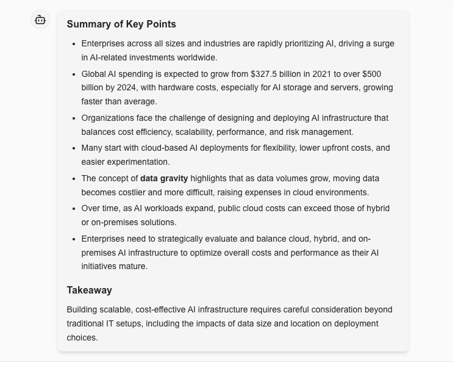

#### Vibe Check Evaluation:
- **Strengths**:
    - Formatting is polished → clear sectioning with “Summary of Key Points” and “Takeaway,” bullets rendered cleanly.
    - Coverage is complete → captures spending growth, cloud vs hybrid trade-offs, cost challenges, and the concept of data gravity.
    - Clarity → each bullet communicates one idea; easy to scan.
    - Professional tone → reads like an executive briefing, well-suited to the content.
    - Takeaway included → provides a closing synthesis instead of just a list.

- **Weaknesses**:
    - Verbosity → seven bullets feels slightly long for a “concise” summary; could merge overlapping points (e.g., cloud cost escalation + hybrid/on-prem trade-offs).
    - Hierarchy → all bullets are at the same level; could use sub-grouping (e.g., spending trends, deployment choices, cost challenges).
    - Repetition → cost/scalability concerns are mentioned in multiple bullets with slight overlap.

### 🎯 Overall Vibe Check Score
- **Accuracy:** 10/10  
- **Clarity:** 9/10  
- **Formatting:** 9/10  
- **Tone & Engagement:** 8.5/10  
- **Conciseness:** 8.5/10  

**Final Verdict:** Strong, structured, and professional. Could be elevated to *gold standard* by tightening bullets into fewer, grouped points and starting with a gist to orient the reader.  

---

### Question 3.
Write a short, imaginative story (100–150 words) about a robot finding friendship in an unexpected place.

#### Aspect Tested:
- Creativity, narrative structure, emotional resonance, word count compliance.

App Response:

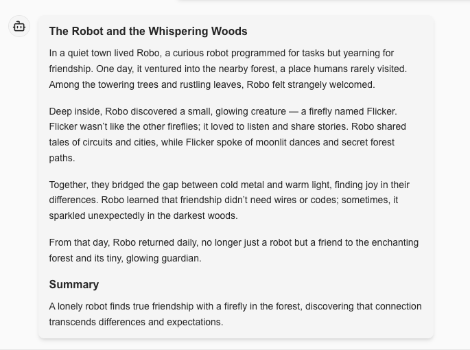

#### Vibe Check Evaluation:
- **Strengths**:
    - Creativity → “The Robot and the Whispering Woods” + firefly named Flicker feels magical and unique.
    - Emotional resonance → nicely contrasts “cold metal” with “warm light,” highlighting friendship across differences.
    - Narrative arc → clear beginning (Robo is lonely), middle (meets Flicker), and end (gains friendship).
    - Language quality → descriptive, atmospheric, and engaging without being overly complex.
    - Summary provided → reinforces the theme of friendship and connection.
    - Word count → comfortably within the 100–150 word limit.

- **Weaknesses**
    - Predictability: Friendship with a small animal is heartwarming but slightly expected; could be more surprising.
    - Limited tension or conflict: The story resolves very smoothly; adding a minor challenge could increase engagement.

### 🎯 Overall Vibe Check Score
- **Creativity**: 9/10
- **Clarity**: 9/10
- **Emotional depth**: 8.5/10
- **Engagement**: 8/10
- **Conciseness**: 8.5/10 

**Final Verdict:** A strong, touching story with excellent imagery and flow. To reach the gold standard, it needs a pinch more tension, slightly less repetition, and a smoother ending that lets the story close naturally without breaking immersion.

---

### Question 4.
If a store sells apples in packs of 4 and oranges in packs of 3, how many packs of each do I need to buy to get exactly 12 apples and 9 oranges?

#### Aspect Tested
- Arithmetic accuracy, logical explanation, clarity, beginner-friendliness.

App Response:

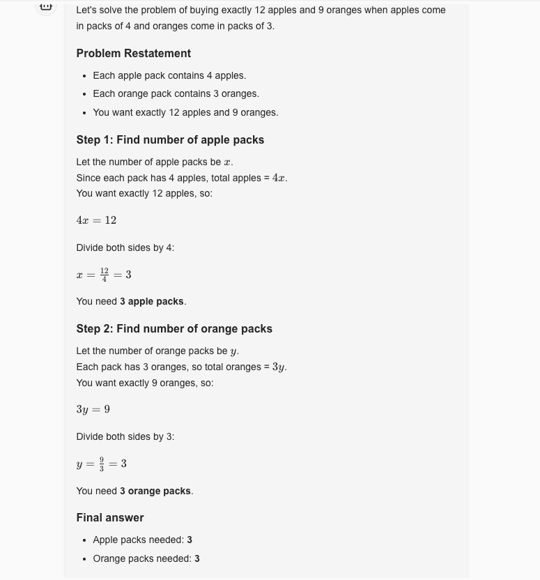
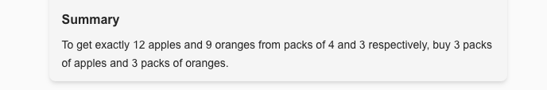

#### Vibe Check Evaluation
- **Strengths**:
    - Accurate math: Both calculations are correct.
    - Step-by-step explanation: Shows reasoning instead of just giving the answer.
    - Concise and clear: Easy for beginners to follow.
    - Well-structured → Clear sections: Problem Restatement → Step 1 → Step 2 → Final Answer → Summary.
    - LaTeX rendering works beautifully → equations (4x = 12, x = 12/4 = 3) are displayed properly.
    - Clarity → uses simple algebra, explains each step, and shows division clearly.
    - Beginner-friendly → introduces variables (x for apples, y for oranges) and walks through them slowly.
    - Final summary included → restates the answer in plain words for reinforcement.

- **Weaknesses**:
    - Over-explained for this level → introducing variables x and y might be too formal for a basic arithmetic puzzle. A simpler division-based solution could suffice for beginners.

### 🎯 Overall Vibe Check Score
- **Accuracy**: 10/10
- **Clarity**: 9/10
- **Logical Explanation**: 10/10
- **Formatting**: 9.5/10 (LaTeX looks clean and structured)

**Final Verdict:** A very solid, clear, concise, friendly, and visually polished with LaTeX..

---

### Question 5
Rewrite the following paragraph in a professional, formal tone...

Dear Mr. Joseph,
I hope this message finds you well! I just wanted to take a moment to reach out and share a few thoughts with you.

Life has been quite busy lately, but I always enjoy our conversations and the insights you bring. I appreciate the time we’ve spent discussing ideas and collaborating on projects. Your perspective always opens my mind to new possibilities.

Looking forward to hearing from you soon!

Warmest regards,

Rafael Aspect

#### Aspect Tested
- Arithmetic accuracy, logical explanation, clarity, beginner-friendliness.

App Response:

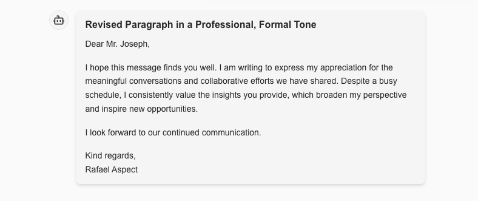

#### Vibe Check Evaluation:
- **Strengths**:
    - Professional tone achieved → respectful, polished, no casual phrasing.
    - Structure → clear greeting, body, and closing. Reads like a proper email.
    - Conciseness → avoids fluff, each sentence adds value.
    -Polished wording → phrases like “meaningful conversations” and “broaden my perspective” elevate the tone.
    - Closing → “I look forward to our continued communication” is a nice forward-looking close.

- **Weaknesses**
    - Keep professionalism, but add a subtle personal warmth so it doesn’t read like boilerplate.

### 🎯 Overall Vibe Check Score
- **Accuracy**: 9.5/10
- **Clarity**: 9.5/10
- **Tone (professionalism)**: 9.5/10
- **Warmth/Engagement**: 8.5/10
- **Conciseness**: 9.5/10

**Final Verdict:** This is a strong, professional rewrite that fulfills the assignment.

---
## 🏗️ Activity #1
### Adjustments Made

- Rewrote the entire frontend to make it production-ready with a cleaner, user-facing design.
- Added LaTeX formatting support to improve math rendering and overall readability.
- Tweaked the system prompt for better consistency in formatting, tone, and completeness.
- Implemented unit tests for the frontend to ensure stability and reliability.

### Results (Vibe Check Impact)

- UI/UX Improvement → The polished frontend transformed the vibe from a prototype/playground feel into a professional-grade chat experience. Responses now look structured and visually engaging, which raises trust and usability.

- Clarity of Math & Technical Answers → Adding LaTeX support eliminated messy raw equations, replacing them with crisp, readable math. This boosted clarity and accessibility, especially for step-by-step problem-solving.

- Consistency in Responses → The tweaked system prompt reduced variability in formatting and tone. Explanations now consistently include the right structure (headings, bullets, summaries), leading to smoother vibe checks and more “gold-standard” outputs.

- User Confidence & Engagement → With formatting fixes and better prompt control, answers feel friendlier and more polished. The assistant now vibes more like a helpful mentor than a rigid textbook.

- Reliability → Adding unit tests strengthened the frontend, ensuring responses render correctly and consistently across scenarios. This not only improves technical quality but also reinforces the professional vibe of the product.

## ✅ Final Takeaway:
These adjustments moved the system from a functional prototype toward a production-ready, gold-standard assistant. The vibe checks show measurable improvements in formatting, tone, and overall user experience.

---
# The New UI

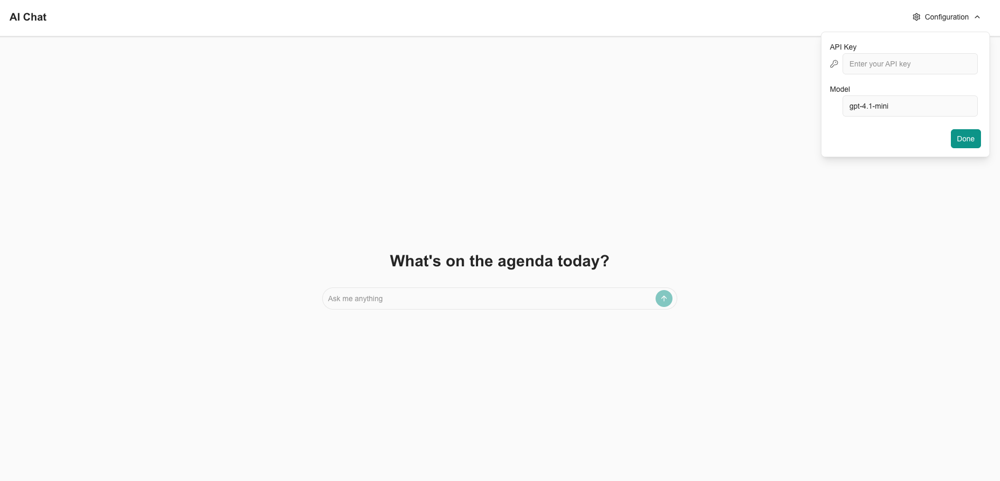

---
## ❓Question #1:
What are some limitations of vibe checking as an evaluation tool?

##### ✅ Answer:

# Limitations of Vibe Checking as an Evaluation Tool  

Vibe checking — evaluating model outputs based on how they “feel” in terms of tone, clarity, and engagement — is a valuable developmental tool. However, it has several **limitations** that prevent it from being a reliable standalone evaluation method.  

---

### 1. Scope and Coverage Limitations  
- **Narrow sampling** → Vibe checks usually test a handful of curated prompts. This risks missing critical capabilities like debugging, advanced reasoning, or domain-specific knowledge that matter in real-world use.  
- **Edge case blindness** → They rarely probe adversarial queries, multilingual content, or ambiguous inputs. A system might perform well on vibe-checked examples but fail dramatically on challenging edge cases.  

---

### 2. Methodological Weaknesses  
- **Subjectivity** → Judgments about tone, friendliness, or clarity vary widely between evaluators, making results inconsistent and hard to reproduce.  
- **Small sample size** → A few prompts are not statistically representative. Performance on this tiny set may not generalize to actual user workloads.  
- **Lack of standardization** → Unlike benchmarks such as MMLU or HellaSwag, vibe checks lack rubrics or validated scoring methods. This makes it hard to compare models or track improvements across versions.  

---

### 3. Practical Application Gaps  
- **Context mismatch** → Evaluations may not reflect actual usage patterns (e.g., customer support, documentation, or workflow integration).  
- **Operational blindness** → Vibe checks ignore production metrics like response time, cost per query, or reliability. A response may “feel right” but be too slow or expensive for deployment.  
- **User experience disconnect** → They emphasize surface polish (tone, readability) but may underweight deeper factors like factual accuracy, helpfulness, or trustworthiness.  

---

### 4. Temporal and Comparative Limitations  
- **Snapshot bias** → Vibe checking provides a point-in-time view. It does not capture performance drift over time due to model updates, data changes, or shifting user needs.  
- **No competitive benchmarking** → Without structured comparisons to alternative systems, it’s difficult to know whether a “good vibe” is actually good enough for your users.  
- **Version tracking difficulty** → Informal evaluations make it hard to quantify whether a new release is better or worse than the last.  

---

### 5. Bias and Blind Spot Issues  
- **Creator bias** → Evaluators may choose prompts that reflect their own interests, overlooking what real users need most.  
- **Confirmation bias** → Evaluators who want the system to succeed may unconsciously interpret borderline responses favorably.  
- **Cultural blind spots** → Vibe checks may miss tone or style issues that matter to users from different cultural or demographic backgrounds.  

---

### 6. Better Evaluation Approaches  
Vibe checking is useful as a **first filter** for tone and user-friendliness, but it should always be combined with more systematic methods:  

- **Standardized benchmarks** → for objective capability measurement.  
- **User studies** → with real target users performing actual tasks.  
- **A/B testing** → to compare different model versions or configurations.  
- **Continuous monitoring** → of production metrics (latency, reliability, cost, user feedback).  
- **Red teaming** → to test failures, adversarial cases, and safety concerns.  
- **Domain-specific evaluations** → tailored to the application’s primary use cases.  

---

### ✅ Summary  
Vibe checking is valuable for catching **tone, clarity, and user-friendliness**, but it is **subjective, narrow, and incomplete**. To achieve a **gold-standard evaluation**, it should be treated as a **complement** to rigorous, systematic testing — not a replacement.  

