# Enhanced RAG System Architecture

## Architecture Overview

## System Enhancement Summary

This enhanced RAG system incorporates 5 major improvements over the basic implementation, providing a production-ready solution for multi-modal document processing and intelligent question answering.

### 🎯 **Key Enhancements Implemented**

#### 1. **📕 PDF Processing**
- Page-level metadata extraction with source attribution
- Rich document metadata (title, author, creation date, page numbers)
- Page-aware chunking that preserves document structure

#### 2. **📊 Multiple Distance Metrics**
- **Cosine Similarity** (default) - Best for semantic similarity
- **Euclidean Distance** - Geometric distance in vector space
- **Manhattan Distance** - Sum of absolute differences
- **Dot Product** - Raw vector similarity measure

#### 3. **🏷️ Enhanced Metadata Support**
- Rich metadata storage and filtering capabilities
- Category-based document organization
- Importance level classification
- Source type tracking and attribution

#### 4. **🧠 Multiple Embedding Models**
- **text-embedding-3-small** (1536D) - Cost-effective, fast processing
- **text-embedding-3-large** (3072D) - Highest quality, best accuracy
- **text-embedding-ada-002** (1536D) - Legacy support, reliable baseline

#### 5. **📺 YouTube Integration**
- Transcript extraction from video URLs
- Timestamp preservation in text chunks
- Video metadata (title, duration, views, channel info)

## Enhanced Query Processing

### 🔍 **Intelligent Retrieval**
- **Semantic Search**: Multiple distance metrics for optimal relevance
- **Metadata Filtering**: Target specific document types, categories, or importance levels
- **Source Attribution**: Full traceability with page numbers and timestamps
- **Quality Controls**: "I don't know" responses for out-of-domain queries

### 📊 **Performance & Analytics**
- **Similarity Scoring**: Transparent relevance metrics for each result
- **Database Statistics**: Performance monitoring and system insights
- **Response Analytics**: Context count and source breakdown
- **Knowledge Boundaries**: Proper handling of irrelevant queries

## Data Flow Architecture

```mermaid
flowchart TB
    %% Input Sources
    subgraph INPUT ["📥 Input Sources"]
        direction LR
        TXT[📄 Text Files<br/>PMarca Blogs]
        PDF[📕 PDF Documents<br/>Rich Metadata]
        YT[📺 YouTube Videos<br/>Transcripts]
    end

    %% Document Processing
    subgraph PROCESS ["🔄 Document Processing"]
        direction LR
        LOAD[Specialized Loaders<br/>TextFile • PDF • YouTube]
        META[Metadata Extraction<br/>Pages • Timestamps • Categories]
        SPLIT[Text Chunking<br/>Preserve Structure]
    end

    %% Middle Row - Embedding and Vector Storage
    subgraph ROW2 [" "]
        direction LR
        subgraph EMBED ["🧠 Embedding Generation"]
            direction TB
            MODELS[Multiple Models<br/>3-small • 3-large • ada-002]
            ASYNC[Async Processing<br/>Batch Operations]
        end
        
        subgraph VECTOR ["🗄️ Enhanced Vector Storage"]
            direction TB
            DB[(Vector Database<br/>with Metadata)]
            METRICS[Multi-Metrics<br/>Cosine • Euclidean • Manhattan]
        end
    end

    %% Bottom Row - Query and Response
    subgraph ROW3 [" "]
        direction LR
        subgraph QUERY ["🔍 Query Processing"]
            direction TB
            SEARCH[Semantic Search<br/>Distance Metrics]
            FILTER[Metadata Filtering<br/>Targeted Retrieval]
        end
        
        subgraph RESPONSE ["🤖 Response Generation"]
            direction TB
            CONTEXT[Context Assembly<br/>Source Attribution]
            LLM[LLM Processing<br/>GPT-4o-mini]
            OUTPUT[Enhanced Response<br/>Citations + Scores]
        end
    end

    %% Main Data Flow
    INPUT --> PROCESS
    PROCESS --> ROW2
    ROW2 --> ROW3

    %% Internal Connections
    TXT --> LOAD
    PDF --> LOAD
    YT --> LOAD
    
    LOAD --> META
    META --> SPLIT
    
    SPLIT --> MODELS
    MODELS --> ASYNC
    
    ASYNC --> DB
    DB --> METRICS
    
    METRICS --> SEARCH
    SEARCH --> FILTER
    
    FILTER --> CONTEXT
    CONTEXT --> LLM
    LLM --> OUTPUT

    %% Styling
    classDef inputStyle fill:#e3f2fd,stroke:#1976d2,stroke-width:2px,color:#000000
    classDef processStyle fill:#fff3e0,stroke:#f57c00,stroke-width:2px,color:#000000
    classDef embedStyle fill:#e8f5e8,stroke:#388e3c,stroke-width:2px,color:#000000
    classDef vectorStyle fill:#f3e5f5,stroke:#7b1fa2,stroke-width:2px,color:#000000
    classDef queryStyle fill:#fce4ec,stroke:#c2185b,stroke-width:2px,color:#000000
    classDef responseStyle fill:#e0f2f1,stroke:#004d40,stroke-width:2px,color:#000000

    class TXT,PDF,YT,INPUT inputStyle
    class LOAD,META,SPLIT,PROCESS processStyle
    class MODELS,ASYNC,EMBED embedStyle
    class DB,METRICS,VECTOR vectorStyle
    class SEARCH,FILTER,QUERY queryStyle
    class CONTEXT,LLM,OUTPUT,RESPONSE responseStyle
```

## Technical Specifications

| Component | Details |
|-----------|---------|
| **Input Formats** | Text (.txt), PDF (.pdf), YouTube URLs |
| **Embedding Models** | OpenAI text-embedding-3-small/large, ada-002 |
| **Vector Dimensions** | 1536 (small/ada-002), 3072 (large) |
| **Distance Metrics** | Cosine, Euclidean, Manhattan, Dot Product |
| **Metadata Fields** | Source, Category, Importance, Pages, Timestamps |
| **LLM Model** | GPT-4o-mini via OpenAI API |
| **Response Features** | Citations, Similarity Scores, Source Attribution |

## Implementation Benefits

### 🚀 **Production Ready**
- Comprehensive error handling and fallback mechanisms
- Scalable architecture supporting multiple document types
- Performance monitoring and analytics capabilities

### 🔍 **Enhanced Accuracy**
- Multiple embedding models for optimal semantic understanding
- Advanced distance metrics for better relevance ranking
- Metadata filtering for targeted, precise retrieval

### 📊 **Full Transparency**
- Complete source attribution with page numbers and timestamps
- Similarity scores for result confidence assessment
- Clear handling of out-of-domain queries

This enhanced RAG system provides a comprehensive, enterprise-ready solution for intelligent document retrieval and question answering with full transparency and quality controls.
