# Enhanced RAG System Architecture

This document provides a comprehensive overview of our enhanced RAG (Retrieval Augmented Generation) system architecture, showcasing all the improvements and enhancements implemented.

## Enhanced RAG System Flow

```mermaid
flowchart TD
    A[📄 Input Documents<br/>PDF + Text + YouTube] --> B[📕 PDF Processing<br/>pdf_utils.py]
    A --> C[📝 Text Loading<br/>text_utils.py]
    A --> D[📺 YouTube Processing<br/>youtube_utils.py]
    
    B --> E[✂️ Text Chunking<br/>CharacterTextSplitter + YouTubeTextSplitter]
    C --> E
    D --> E
    
    E --> F[🧠 Embedding Generation<br/>Multiple OpenAI Models]
    
    G[❓ User Query] --> H[🔍 Query Processing<br/>Same Embedding Model]
    
    F --> I[🗄️ Enhanced Vector Database<br/>with Metadata + Multi-Metrics]
    H --> I
    
    I --> J[🎯 Semantic Search<br/>+ Metadata Filtering]
    
    J --> K[📋 Context Retrieval<br/>with Source Attribution]
    
    K --> L[🤖 AI Response Generation<br/>OpenAI Chat API]
    
    L --> M[✅ Enhanced Response<br/>with Citations + Similarity Scores]

    %% Styling
    classDef inputStyle fill:#e3f2fd,stroke:#1976d2,stroke-width:3px
    classDef processStyle fill:#fff3e0,stroke:#f57c00,stroke-width:3px
    classDef embeddingStyle fill:#e8f5e8,stroke:#388e3c,stroke-width:3px
    classDef searchStyle fill:#fce4ec,stroke:#c2185b,stroke-width:3px
    classDef outputStyle fill:#f1f8e9,stroke:#689f38,stroke-width:3px

    class A inputStyle
    class B,C,D,E processStyle
    class F,G,H embeddingStyle
    class I,J,K searchStyle
    class L,M outputStyle
```



## Detailed Architecture Overview

```mermaid
graph TB
    %% Input Sources
    subgraph "📥 Input Sources"
        TXT[📄 Text Files<br/>PMarca Blogs]
        PDF[📕 PDF Documents<br/>Rich Metadata]
        YT[📺 YouTube Videos<br/>Transcript + Timestamps]
    end

    %% Document Processing Layer
    subgraph "🔄 Document Processing Layer"
        TL[TextFileLoader]
        PL[PDFLoader<br/>+ Metadata Extraction]
        YTL[YouTubeTranscriptLoader<br/>+ Video Metadata]
        
        TS[CharacterTextSplitter]
        YTS[YouTubeTextSplitter<br/>Timestamp Preservation]
    end

    %% Embedding Layer
    subgraph "🧠 Embedding Layer"
        subgraph "🎯 Multiple Embedding Models"
            EM1[text-embedding-3-small<br/>1536 dims, Cost-effective]
            EM2[text-embedding-3-large<br/>3072 dims, High Quality]
            EM3[text-embedding-ada-002<br/>1536 dims, Legacy]
        end
        
        EMB[EmbeddingModel<br/>Async Processing]
    end

    %% Enhanced Vector Database
    subgraph "🗄️ Enhanced Vector Database"
        subgraph "📊 Multiple Distance Metrics"
            DM1[Cosine Similarity]
            DM2[Euclidean Distance]
            DM3[Manhattan Distance]
            DM4[Dot Product]
        end
        
        subgraph "🏷️ Metadata Management"
            META[Rich Metadata Storage<br/>• Source Type<br/>• Categories<br/>• Importance Levels<br/>• Timestamps<br/>• Page Numbers]
            FILTER[Metadata Filtering<br/>• By Category<br/>• By Importance<br/>• By Source Type<br/>• By Date Range]
        end
        
        EVD[EnhancedVectorDatabase<br/>Metadata + Multi-Metrics]
        VD[VectorDatabase<br/>Basic Implementation]
    end

    %% RAG Pipeline
    subgraph "🔍 RAG Pipeline"
        subgraph "🎯 Query Processing"
            QE[Query Embedding<br/>Same Model as Corpus]
            VS[Vector Search<br/>Top-k Retrieval]
            MF[Metadata Filtering<br/>Optional Constraints]
        end
        
        subgraph "📝 Response Generation"
            CP[Context Preparation<br/>Source Attribution]
            SP[System Prompts<br/>Configurable Style]
            UP[User Prompts<br/>Context + Query]
        end
        
        RAG[RetrievalAugmentedQAPipeline<br/>Orchestrates Full Flow]
    end

    %% LLM Layer
    subgraph "🤖 Language Model Layer"
        LLM[ChatOpenAI<br/>gpt-4o-mini]
        RESP[Response Generation<br/>Context-Aware]
    end

    %% Output & Analytics
    subgraph "📊 Output & Analytics"
        subgraph "📈 Response Analytics"
            SCORES[Similarity Scores<br/>Transparency]
            SOURCES[Source Attribution<br/>Traceability]
            STATS[Database Statistics<br/>Performance Metrics]
        end
        
        subgraph "🎯 Quality Controls"
            BOUNDS[Knowledge Boundaries<br/>"I don't know" responses]
            FILTER_OUT[Out-of-Domain Detection<br/>Quantum Physics → "I don't know"]
        end
        
        OUTPUT[📤 Final Response<br/>+ Metadata + Scores]
    end

    %% Data Flow Connections
    TXT --> TL
    PDF --> PL
    YT --> YTL
    
    TL --> TS
    PL --> TS
    YTL --> YTS
    
    TS --> EMB
    YTS --> EMB
    
    EM1 --> EMB
    EM2 --> EMB
    EM3 --> EMB
    
    EMB --> EVD
    EMB --> VD
    
    DM1 --> EVD
    DM2 --> EVD
    DM3 --> EVD
    DM4 --> EVD
    
    META --> EVD
    FILTER --> EVD
    
    EVD --> RAG
    VD --> RAG
    
    QE --> VS
    VS --> MF
    MF --> CP
    CP --> SP
    SP --> UP
    UP --> LLM
    
    RAG --> LLM
    LLM --> RESP
    RESP --> SCORES
    RESP --> SOURCES
    RESP --> STATS
    RESP --> BOUNDS
    RESP --> FILTER_OUT
    
    SCORES --> OUTPUT
    SOURCES --> OUTPUT
    STATS --> OUTPUT
    BOUNDS --> OUTPUT
    FILTER_OUT --> OUTPUT

    %% Styling
    classDef inputStyle fill:#e1f5fe,stroke:#01579b,stroke-width:2px
    classDef processStyle fill:#f3e5f5,stroke:#4a148c,stroke-width:2px
    classDef embeddingStyle fill:#e8f5e8,stroke:#1b5e20,stroke-width:2px
    classDef databaseStyle fill:#fff3e0,stroke:#e65100,stroke-width:2px
    classDef ragStyle fill:#fce4ec,stroke:#880e4f,stroke-width:2px
    classDef llmStyle fill:#e0f2f1,stroke:#004d40,stroke-width:2px
    classDef outputStyle fill:#f1f8e9,stroke:#33691e,stroke-width:2px

    class TXT,PDF,YT inputStyle
    class TL,PL,YTL,TS,YTS processStyle
    class EM1,EM2,EM3,EMB embeddingStyle
    class EVD,VD,DM1,DM2,DM3,DM4,META,FILTER databaseStyle
    class QE,VS,MF,CP,SP,UP,RAG ragStyle
    class LLM,RESP llmStyle
    class SCORES,SOURCES,STATS,BOUNDS,FILTER_OUT,OUTPUT outputStyle
```

## Key Enhancements Implemented

### 🎯 1. Multi-Modal Document Support
- **Text Files**: Original PMarca blog content processing
- **PDF Documents**: Rich metadata extraction (title, author, pages, creation date)
- **YouTube Videos**: Transcript extraction with timestamp preservation

### 🧠 2. Multiple Embedding Models
- **text-embedding-3-small**: 1536 dimensions, cost-effective baseline
- **text-embedding-3-large**: 3072 dimensions, highest quality
- **text-embedding-ada-002**: 1536 dimensions, legacy support

### 🗄️ 3. Enhanced Vector Database
- **Multiple Distance Metrics**: Cosine, Euclidean, Manhattan, Dot Product
- **Rich Metadata Support**: Categories, importance levels, source attribution
- **Advanced Filtering**: Query by metadata constraints
- **Performance Analytics**: Database statistics and metrics

### 🔍 4. Intelligent RAG Pipeline
- **Context-Aware Retrieval**: Metadata-enhanced document selection
- **Source Attribution**: Full traceability of information sources
- **Similarity Scoring**: Transparent relevance metrics
- **Knowledge Boundaries**: Proper handling of out-of-domain queries

### 📊 5. Quality Assurance Features
- **Out-of-Domain Detection**: "I don't know" responses for irrelevant queries
- **Source Transparency**: Clear attribution with similarity scores
- **Performance Monitoring**: Database statistics and search analytics
- **Configurable Responses**: Adjustable style and detail levels

## Data Flow Summary

1. **Input Processing**: Multiple document types → Specialized loaders
2. **Text Chunking**: Content splitting with metadata preservation
3. **Embedding Generation**: Multiple model options for vector creation
4. **Vector Storage**: Enhanced database with metadata and multi-metric support
5. **Query Processing**: Intelligent retrieval with filtering capabilities
6. **Response Generation**: Context-aware LLM responses with attribution
7. **Output Delivery**: Rich responses with transparency and quality controls

## Technical Specifications

### Supported File Types
- `.txt` - Plain text documents
- `.pdf` - PDF documents with metadata extraction
- YouTube URLs - Video transcript processing

### Embedding Models
- OpenAI text-embedding-3-small (1536D)
- OpenAI text-embedding-3-large (3072D)
- OpenAI text-embedding-ada-002 (1536D)

### Distance Metrics
- Cosine Similarity (default)
- Euclidean Distance
- Manhattan Distance
- Dot Product

### Metadata Fields
- Source type and URL
- Document categories
- Importance levels
- Timestamps (for video content)
- Page numbers (for PDF content)
- Processing metadata

This enhanced RAG system provides a comprehensive, production-ready solution for multi-modal document retrieval and question answering with full transparency and quality controls.
