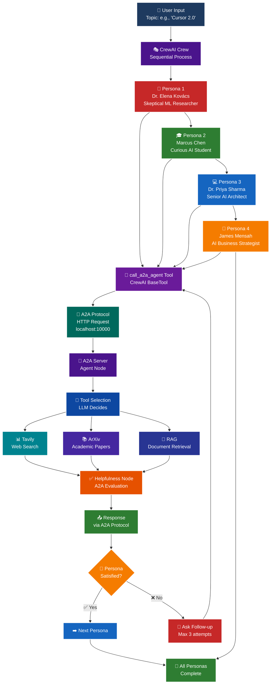

# 🎭 CrewAI Persona-Based Agents - Advanced Build

This is the **Advanced Build** for Session 15, demonstrating how different agent frameworks can interoperate via the A2A protocol.

## 📋 Overview

This implementation uses **CrewAI** (a different agent framework from LangGraph) to create 4 persona-based agents that interact with your A2A server. Each persona has a unique personality, goals, and questioning style.

## 🏗️ Architecture



## 🎭 The Four Personas

### 1. 🔬 Dr. Elena Kovács - Skeptical ML Researcher

**Background:** Tenured Stanford professor, PhD from MIT, 60+ publications in top-tier conferences

**Personality:**
- Demands rigorous evidence and benchmarks
- Won't accept claims without sources
- Frustrated by marketing speak
- Wants technical depth and comparative analysis

**Questioning Style:**
```
Q1: "Find technical papers and benchmarks about [topic]"
[Evaluates: Does it have sources? Detailed enough?]
Q2: "Provide specific performance benchmarks and architectural details"
[Evaluates: Is there empirical evidence?]
Q3: "Compare this to state-of-the-art alternatives with metrics"
```

---

### 2. 🎓 Marcus Chen - Curious AI Student

**Background:** UC Berkeley CS undergraduate, passionate about AI, still learning fundamentals

**Personality:**
- Eager to learn but needs simple explanations
- Not afraid to ask "I don't understand"
- Loves analogies and real-world examples
- Wants to truly grasp concepts, not just memorize

**Questioning Style:**
```
Q1: "Explain [topic] in simple terms - what is it and why does it matter?"
[Evaluates: Is it clear? Any confusing jargon?]
Q2: "Can you explain [confusing part] with an analogy?"
[Evaluates: Does it make sense now?]
Q3: "Give me a real-world example of how this works"
```

---

### 3. 💻 Dr. Priya Sharma - Senior AI Architect

**Background:** Principal AI Architect at Fortune 500, 15 years building production ML systems

**Personality:**
- Thinks in terms of system design, not just algorithms
- Cares about scalability, reliability, operational excellence
- Wants to understand engineering trade-offs
- Focuses on production considerations

**Questioning Style:**
```
Q1: "What's the system architecture and scalability characteristics of [topic]?"
[Evaluates: Does it cover system design? Performance?]
Q2: "What are the infrastructure requirements and failure modes?"
[Evaluates: Production-ready insights?]
Q3: "What are the operational trade-offs and deployment considerations?"
```

---

### 4. 💼 James Mensah - AI Business Strategist

**Background:** VP of AI Strategy at global consulting firm, led 50+ AI transformation projects

**Personality:**
- Focuses on business impact, not technical details
- Needs to justify AI investments to C-suite
- Cares about ROI and competitive advantage
- Thinks in terms of measurable business value

**Questioning Style:**
```
Q1: "What are the practical business applications and use cases for [topic]?"
[Evaluates: Does it show business value? Real applications?]
Q2: "What's the ROI and how does it compare to alternatives?"
[Evaluates: Can I justify this to executives?]
Q3: "What's the total cost of ownership and implementation timeline?"
```

---

## 🚀 How to Use

### Quick Start

```bash
# Terminal 1: Start the A2A server
make server

# Terminal 2: Run persona agents
make test-personas
```

### What Happens:

1. **Persona Lineup**: Shows all 4 personas with their goals
2. **Topic Selection**: You choose what to research (e.g., "Kimi K2")
3. **Sequential Execution**: Each persona researches the topic in order
4. **Autonomous Follow-ups**: Personas ask 1-3 questions based on their satisfaction
5. **Results**: See how each persona approached the same topic differently

### Example Session:

```
🎭 PERSONA CREW ANALYSIS: Kimi K2

1. 🔬 Dr. Elena Kovács (Skeptical ML Researcher)
   Turn 1: "Find technical papers and benchmarks about Kimi K2"
   🔧 Calling A2A server...
   📥 Response: [ArXiv papers found]
   🤔 Evaluation: Not satisfied - needs performance benchmarks
   
   Turn 2: "Provide performance benchmarks comparing Kimi K2 to GPT-4"
   🔧 Calling A2A server...
   📥 Response: [Benchmark data]
   ✅ Satisfied!

2. 🎓 Marcus Chen (Curious AI Student)
   Turn 1: "Explain Kimi K2 in simple terms"
   🔧 Calling A2A server...
   📥 Response: [Technical explanation]
   🤔 Evaluation: Too technical - needs simpler explanation
   
   Turn 2: "Explain Kimi K2 like I'm 5 years old"
   🔧 Calling A2A server...
   📥 Response: [Simple explanation]
   ✅ Satisfied!

[... Dr. Priya Sharma and James Mensah continue ...]
```

## 🔍 Key Concepts Demonstrated

### 1. **Framework Interoperability**
- CrewAI agents using A2A protocol
- Different framework, same protocol
- Proves A2A enables cross-framework communication

### 2. **Persona-Driven Behavior**
- Each agent has unique goals and evaluation criteria
- Same topic, different perspectives
- Autonomous decision-making about follow-ups

### 3. **Multi-Turn Conversations**
- Personas persist across multiple queries
- Context-aware follow-up questions
- Goal-oriented interaction patterns

### 4. **Agent Composition**
- 4 specialized agents working independently
- Each uses the same A2A tool
- Sequential orchestration via CrewAI

## 🎯 Comparison: LangGraph vs CrewAI

| Aspect | LangGraph Client | CrewAI Personas |
|--------|------------------|-----------------|
| **Framework** | LangGraph | CrewAI |
| **Agents** | 1 generic agent | 4 specialized personas |
| **Personality** | Neutral | Distinct personalities |
| **Goals** | Answer user query | Persona-specific goals |
| **Follow-ups** | User-driven | Autonomous |
| **Use Case** | General purpose | Specialized perspectives |

## 🧪 Testing Different Topics

Try these topics to see how personas react differently:

### Technical Topics:
- "Kimi K2"
- "GPT-4 architecture"
- "Transformer attention mechanisms"
- "RAG systems"

### Business Topics:
- "AI adoption strategies"
- "LLM cost optimization"
- "AI ROI measurement"

### Mixed Topics:
- "Claude 3.5 Sonnet"
- "Llama 3"
- "Gemini Pro"

## 🔧 Customization

### Add New Personas

Edit `app/persona_agents.py`:

```python
def create_persona_agents():
    # ... existing personas ...
    
    # Add your new persona
    new_persona = Agent(
        role="Your Name (Your Role)",
        goal="Your specific goal",
        backstory="Your detailed backstory...",
        tools=[call_a2a_agent],
        verbose=True,
        allow_delegation=False
    )
    
    return [dr_elena, marcus, dr_priya, james, new_persona]
```

### Modify Persona Behavior

Change the task descriptions in `create_persona_tasks()` to adjust:
- Number of follow-up attempts
- Evaluation criteria
- Question patterns

### Change Execution Order

Modify the `Process` in `run_persona_crew()`:
- `Process.sequential` - One at a time (current)
- `Process.hierarchical` - Manager coordinates
- Custom order by reordering the agents list

## 🐛 Troubleshooting

### "Could not connect to A2A server"

**Solution:** Start the server first:
```bash
make server
```

### CrewAI takes a long time

**Cause:** Each persona may ask multiple questions (up to 3 each)

**Solution:** This is normal - 4 personas × 3 questions = up to 12 A2A calls

### Personas not asking follow-ups

**Cause:** CrewAI's task execution may complete on first attempt

**Solution:** This is okay - it means the persona was satisfied with the initial response

## 📊 Expected Output

```
================================================================================
CREWAI PERSONA-BASED AGENT DEMONSTRATION
Testing 4 Different Personas Using A2A Protocol
================================================================================

PERSONA LINEUP
================================================================================

1. 🔬 Dr. Elena Kovács - Skeptical ML Researcher
   Goal: Demands technical papers, benchmarks, and rigorous evidence
   Style: Won't accept claims without sources

2. 🎓 Marcus Chen - Curious AI Student
   Goal: Wants simple explanations with clear examples
   Style: Asks follow-ups when things aren't clear

3. 💻 Dr. Priya Sharma - Senior AI Architect
   Goal: Analyzes architecture, scalability, and trade-offs
   Style: Thinks in terms of production systems

4. 💼 James Mensah - AI Business Strategist
   Goal: Evaluates ROI and business value
   Style: Focuses on measurable business impact

[Each persona then executes their research...]
```

## 🎓 Learning Outcomes

After working with persona agents, you'll understand:

1. **Framework Flexibility**: A2A works with any framework (LangGraph, CrewAI, etc.)
2. **Persona Design**: How to create agents with distinct personalities
3. **Goal-Oriented Agents**: Agents that pursue specific objectives
4. **Multi-Agent Orchestration**: How CrewAI coordinates multiple agents
5. **Cross-Framework Communication**: Different frameworks using the same protocol

## 🚢 Next Steps

- Modify persona backstories to create different personalities
- Add more personas (e.g., Security Expert, UX Researcher)
- Implement hierarchical process where personas collaborate
- Create persona-specific evaluation metrics
- Build a web UI for persona selection

---

This demonstrates the power of A2A: **different agent frameworks working together through standardized protocols**! 🎉
