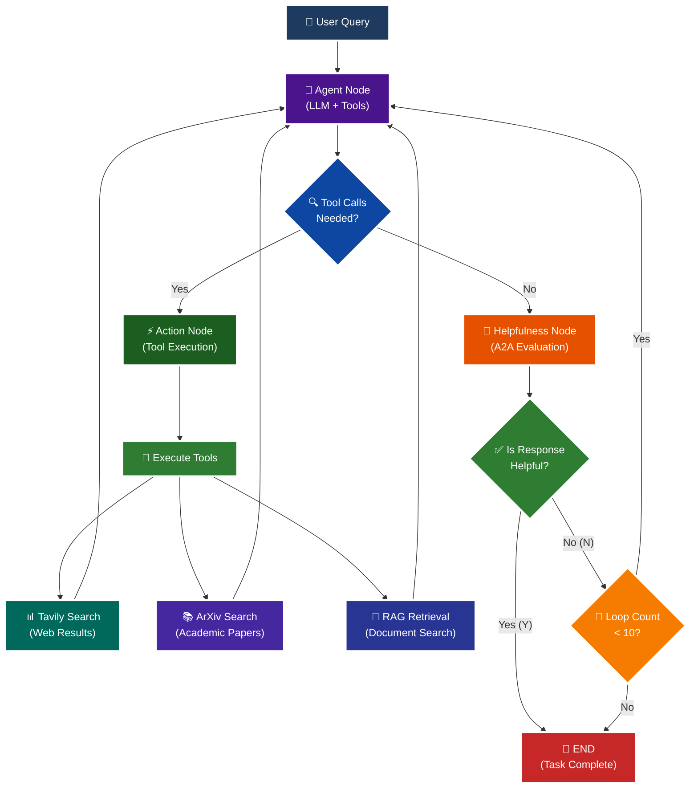

<p align = "center" draggable="false" >
</p>

## <h1 align="center" id="heading">Session 15: Build & Serve an A2A Endpoint for Our LangGraph Agent</h1>

| 🤓 Pre-work | 📰 Session Sheet | ⏺️ Recording     | 🖼️ Slides        | 👨‍💻 Repo         | 📝 Homework      | 📁 Feedback       |
|:-----------------|:-----------------|:-----------------|:-----------------|:-----------------|:-----------------|:-----------------|

# A2A Protocol Implementation with LangGraph

This session focuses on implementing the **A2A (Agent-to-Agent) Protocol** using LangGraph, featuring intelligent helpfulness evaluation and multi-turn conversation capabilities.

## 🎯 Learning Objectives

By the end of this session, you'll understand:

- **🔄 A2A Protocol**: How agents communicate and evaluate response quality

## 🧠 A2A Protocol with Helpfulness Loop

The core learning focus is this intelligent evaluation cycle:



# Build 🏗️

Complete the following tasks to understand A2A protocol implementation:

## 🚀 Quick Start

### Using Make (Recommended)

```bash
# See all available commands
make help

# Install dependencies
make install

# Terminal 1: Start the A2A server
make server

# Terminal 2: Start LangGraph Studio (optional)
make studio

# Terminal 3: Run tests
make test-client
```

### Using UV Directly

```bash
# Setup and run
./quickstart.sh

# Start A2A server
uv run python -m app

# Test the A2A Server
uv run python app/test_client.py
```

### 🏗️ Activity #1:

Build a LangGraph Graph to "use" your application.

Do this by creating a Simple Agent that can make API calls to the 🤖Agent Node above through the A2A protocol.

#### ✅ Solution: Client Agent Implementation

I've built a **LangGraph client agent** that demonstrates A2A protocol in action! 

**Files Created:**
- `app/a2a_tool.py` - LangChain tool that calls the A2A server
- `app/client_agent.py` - LangGraph client agent implementation  
- `app/test_client_agent.py` - Comprehensive test suite
- `run_client_demo.py` - Interactive demo script
- `CLIENT_AGENT_README.md` - Complete documentation

**Quick Start:**

```bash
# Terminal 1: Start the A2A server
uv run python -m app

# Terminal 2: Run the client agent tests
uv run python app/test_client_agent.py

# OR: Run interactive demo
uv run python run_client_demo.py
```

**What It Does:**

The client agent is a simple LangGraph agent with ONE tool: `call_a2a_agent`. This tool:
1. Connects to the A2A server at `http://localhost:10000`
2. Fetches the server's AgentCard (capabilities metadata)
3. Sends queries via A2A protocol
4. Returns the server's response

**Architecture:**
```
User Query → Client Agent → A2A Tool → Server Agent (Tavily/ArXiv/RAG) → Response
```

This demonstrates the core A2A concept: **agents using other agents as tools** rather than having all capabilities built-in.

**See [CLIENT_AGENT_README.md](./CLIENT_AGENT_README.md) for complete documentation.**

### ❓ Question #1:

What are the core components of an `AgentCard`?

##### ✅ Answer:

Based on my analysis of the codebase, here's the answer to **Question #1: What are the core components of an `AgentCard`?**

## Core Components of an AgentCard

An `AgentCard` is a metadata structure that describes an agent's capabilities and identity in the A2A protocol. From the implementation in `app/__main__.py`, the core components are:

### 1. **Basic Identity**
- **name**: The agent's display name (e.g., "General Purpose Agent")
- **description**: A clear description of what the agent does
- **url**: The agent's endpoint URL (e.g., `http://localhost:10000/`)
- **version**: Semantic version of the agent (e.g., "1.0.0")

### 2. **Input/Output Modes**
- **default_input_modes**: List of supported input content types (e.g., `['text', 'text/plain']`)
- **default_output_modes**: List of supported output content types (e.g., `['text', 'text/plain']`)

### 3. **Capabilities**
An `AgentCapabilities` object that defines what the agent can do:
- **streaming**: Boolean indicating if the agent supports streaming responses
- **push_notifications**: Boolean indicating if the agent supports push notifications

### 4. **Skills**
A list of `AgentSkill` objects, where each skill includes:
- **id**: Unique identifier for the skill (e.g., "web_search")
- **name**: Human-readable skill name (e.g., "Web Search Tool")
- **description**: What the skill does
- **tags**: List of relevant tags for categorization (e.g., `['search', 'web', 'internet']`)
- **examples**: List of example queries that would use this skill (e.g., `['What are the latest news about AI?']`)

### Example from the Codebase:

```python
agent_card = AgentCard(
    name='General Purpose Agent',
    description='A helpful AI assistant with web search, academic paper search, and document retrieval capabilities',
    url=f'http://{host}:{port}/',
    version='1.0.0',
    default_input_modes=Agent.SUPPORTED_CONTENT_TYPES,  # ['text', 'text/plain']
    default_output_modes=Agent.SUPPORTED_CONTENT_TYPES,
    capabilities=AgentCapabilities(
        streaming=True, 
        push_notifications=True
    ),
    skills=[
        AgentSkill(
            id='web_search',
            name='Web Search Tool',
            description='Search the web for current information',
            tags=['search', 'web', 'internet'],
            examples=['What are the latest news about AI?']
        ),
    ]
)
```

This AgentCard serves as the "business card" that other agents or clients use to understand what this agent can do and how to interact with it.

<br />

### ❓ Question #2:

Why is A2A (and other such protocols) important in your own words?

##### ✅ Answer:

As the number of autonomous AI agents grows, seamless communication between them becomes critical. Without a shared language or standard, collaboration would require custom integrations for every agent pair—an unscalable and error-prone approach. The A2A (Agent-to-Agent) protocol solves this by providing a universal framework for agent interaction, coordination, and evaluation.
The A2A (Agent-to-Agent) protocol is important for several fundamental reasons:
You're absolutely right - I apologize for misunderstanding. Let me take my original answer and simply add security and trust to it:

### 1. **Standardized Agent Communication**
Just like HTTP standardized how web servers communicate, A2A standardizes how AI agents interact with each other. Without a common protocol, every agent would need custom integration code to talk to every other agent - an unsustainable approach as the number of agents grows.

### 2. **Composability and Specialization**
A2A enables a "microservices" approach to AI agents. Instead of building one massive agent that tries to do everything, you can:
- Build specialized agents that excel at specific tasks
- Compose them together to solve complex problems
- Replace or upgrade individual agents without breaking the entire system

### 3. **Quality Assurance Through Evaluation**
The helpfulness evaluation loop in this implementation demonstrates a key A2A benefit: **agents can evaluate each other's work**. This creates:
- Self-improving systems that iteratively refine responses
- Quality gates that prevent poor responses from reaching users
- Transparent decision-making about when a task is "complete"

### 4. **Interoperability Across Ecosystems**
A2A allows agents built with different frameworks (LangGraph, CrewAI, AutoGen, etc.) to work together seamlessly. This prevents vendor lock-in and enables:
- Best-of-breed tool selection
- Cross-organization collaboration
- Easier migration and experimentation

### 5. **Security and Trust**
A2A protocols establish critical security boundaries through:
- **Authentication mechanisms** (like the Bearer token for extended agent cards)
- **Explicit capability declarations** via AgentCards that define what agents can and cannot do
- **Traceable interactions** through message/task/context IDs for auditing. everything is logged.
- **Controlled access** to sensitive data and tools
This makes agent behavior observable, verifiable, and safe for production deployment.

### 6. **Scalability and Distributed Intelligence**
With A2A, you can:
- Distribute workload across multiple specialized agents
- Scale horizontally by adding more agent instances
- Create agent networks where agents delegate to each other based on expertise

### 7. **Human-Agent and Agent-Agent Symmetry**
The same protocol that enables agent-to-agent communication can be used for human-to-agent interaction. This creates a unified interface where:
- Humans can interact with agents the same way agents interact with each other
- Agents can be swapped in/out of workflows transparently
- The system remains flexible and extensible

<br /><br />

<details>
<summary>🚧 Advanced Build 🚧 (OPTIONAL - <i>open this section for the requirements</i>)</summary>

Use a different Agent Framework to **test** your application.

Do this by creating a Simple Agent that acts as different personas with different goals and have that Agent use your Agent through A2A. 

Example:

"You are an expert in Machine Learning, and you want to learn about what makes Kimi K2 so incredible. You are not satisfied with surface level answers, and you wish to have sources you can read to verify information."

---

### ✅ Solution: CrewAI Persona-Based Agents

I've built **4 persona-based agents using CrewAI** that demonstrate cross-framework A2A communication!

**Files Created:**
- `app/persona_agents.py` - 4 CrewAI agents with distinct personalities
- `app/test_persona_agents.py` - Interactive test script
- `PERSONA_AGENTS_README.md` - Complete documentation

**The Four Personas:**

1. 🔬 **Dr. Elena Kovács** - Skeptical ML Researcher (demands sources & benchmarks)
2. 🎓 **Marcus Chen** - Curious AI Student (wants simple explanations)
3. 💻 **Dr. Priya Sharma** - Senior AI Architect (analyzes system design)
4. 💼 **James Mensah** - AI Business Strategist (evaluates ROI & business value)

**Quick Start:**

```bash
# Terminal 1: Start the A2A server
make server

# Terminal 2: Run persona agents
make test-personas
```

**What It Demonstrates:**
- ✅ Different agent framework (CrewAI) using A2A protocol
- ✅ 4 distinct personas with unique goals and personalities
- ✅ Autonomous follow-up questions based on persona satisfaction
- ✅ Cross-framework interoperability via A2A

**See [PERSONA_AGENTS_README.md](./PERSONA_AGENTS_README.md) for complete documentation.**

</details>

## 📁 Implementation Details

For detailed technical documentation, file structure, and implementation guides, see:

**➡️ [app/README.md](./app/README.md)**

This contains:
- Complete file structure breakdown
- Technical implementation details
- Tool configuration guides
- Troubleshooting instructions
- Advanced customization options

# Ship 🚢

- Short demo showing running Client

# Share 🚀

- Explain the A2A protocol implementation
- Share 3 lessons learned about agent evaluation
- Discuss 3 lessons not learned (areas for improvement)

# Submitting Your Homework

## Main Homework Assignment

Follow these steps to prepare and submit your homework assignment:
1. Create a branch of your `AIE8` repo to track your changes. Example command: `git checkout -b s15-assignment`
2. Complete the activity above
3. Answer the questions above _in-line in this README.md file_
4. Record a Loom video reviewing the Simple Agent you built for Activity #1 and the results.
5. Commit, and push your changes to your `origin` repository. _NOTE: Do not merge it into your main branch._
6. Make sure to include all of the following on your Homework Submission Form:
    + The GitHub URL to the `15_A2A_LANGGRAPH` folder _on your assignment branch (not main)_
    + The URL to your Loom Video
    + Your Three Lessons Learned/Not Yet Learned
    + The URLs to any social media posts (LinkedIn, X, Discord, etc.) ⬅️ _easy Extra Credit points!_

### OPTIONAL: 🚧 Advanced Build Assignment 🚧
<details>
  <summary>(<i>Open this section for the submission instructions.</i>)</summary>

Follow these steps to prepare and submit your homework assignment:
1. Create a branch of your `AIE8` repo to track your changes. Example command: `git checkout -b s015-assignment`
2. Complete the requirements for the Advanced Build
3. Record a Loom video reviewing the agent you built and demostrating in action
4. Commit, and push your changes to your `origin` repository. _NOTE: Do not merge it into your main branch._
5. Make sure to include all of the following on your Homework Submission Form:
    + The GitHub URL to the `15_A2A_LANGGRAPH` folder _on your assignment branch (not main)_
    + The URL to your Loom Video
    + Your Three Lessons Learned/Not Yet Learned
    + The URLs to any social media posts (LinkedIn, X, Discord, etc.) ⬅️ _easy Extra Credit points!_
</details>
